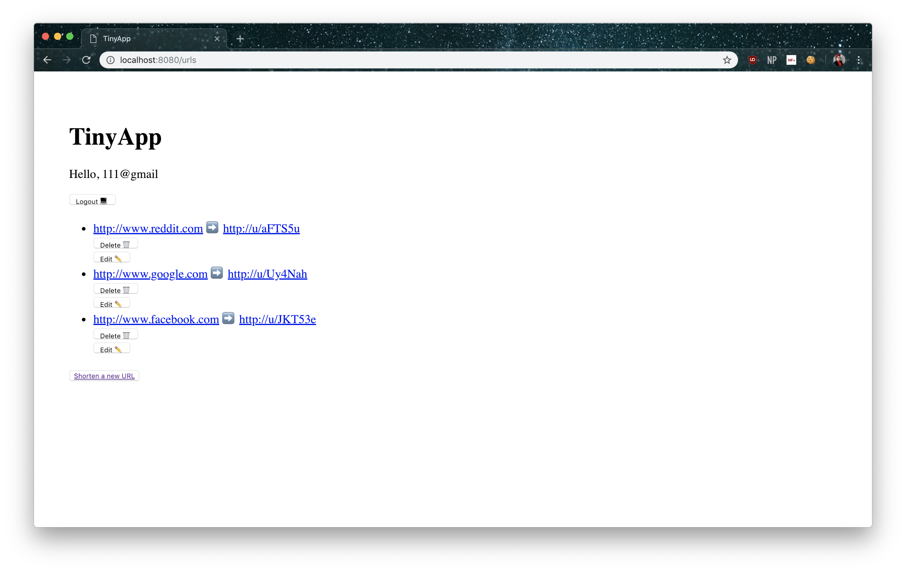
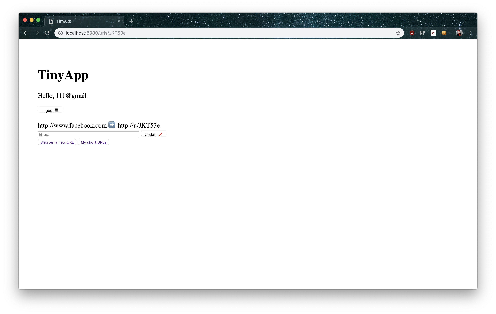

# TinyApp - by Ghabe Bossin

<!---...(aka make links smol)-->

This is the first solo project in the Lighthouse Labs Web Developer bootcamp. It currently meets all major functional/display requirements most minor requirements and I have fixed all bugs I have been able to find. My eventual goal is to update the app with better stylings.

#### Screenshots

## Project Description

This four-day project will have you building a web app using Node. The app will allow users to shorten long URLs much like TinyURL.com and bit.ly do.

You will build an HTTP Server that handles requests from the browser (client). Along the way you'll get introduced to some more advanced JavaScript and Node concepts, and you'll also learn more about Express, a web framework which is very popular in the Node community.

### Expected Usage

**TinyApp** is a full stack web app built with Node and Express that allows users to shorten long URLs much like TinyURL.com and bit.ly.

### Dependencies

* Node.js
* Express
* EJS
* bcrypt
* body-parser
* cookie-session
* randomstring - found [here](https://www.npmjs.com/package/randomstring).

### Getting started

* Install all dependancies listed above (using the `npm install` command).
* Run the development web server (using `node express_server.js` command).
